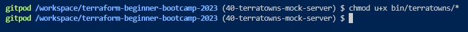

# Terraform Beginner Bootcamp 2023 - Week 2

## Working with Ruby

### Bundler

Bundler is a package manager for ruby.
It is the primary way to install ruby packages (known as gems) for ruby.

#### Install Gems

You need to create a Gemfile and define your gems in that file.

```rb
source "https://rubygems.org"

gem 'sinatra'
gem 'rake'
gem 'pry'
gem 'puma'
gem 'activerecord'
```

Then you need to run the `bundle install` command

This will install the gems on the system globally (unlike nodejs which install packages in place in a folder called node_modules)

A Gemfile.lock will be created to lock down the gem versions used in this project.

#### Executing ruby scripts in the context of bundler

We have to use `bundle exec` to tell future ruby scripts to use the gems we installed. This is the way we set context.

### Sinatra

Sinatra is a micro web-framework for ruby to build web-apps.

Its great for mock or development servers or for very simple projects.

You can create a web-server in a single file.

https://sinatrarb.com/

## Terratowns Mock Server

### Running the web server

We can run the web server by executing the following commands:

```rb
bundle install
bundle exec ruby server.rb
```

All of the code for our server is stored in the `server.rb` file.

## CRUD

Terraform Provider resources utilize CRUD.

CRUD stands for Create, Read Update, and Delete

https://en.wikipedia.org/wiki/Create,_read,_update_and_delete

## My Notes

# Week 2 Architecture
These architecture diagrams were provided by Andrew Brown


## Terratowns Mock Server

We wrote a customer provider named `terraform-provider-terratowns` (written in **golang**). `main.go` file will contain all of the code for our custom TF provider. go.mod file is used for managing dependencies and defining module properties.This custom provider has a **resource** called `Home` which has four actions Create, Read, Update, Delete associated with it.


We created a new issue in your Github repositiory to download Terratowns mock server into our repo


We deleted the `.git` directory, to avoid the imported code to be treated as a sub-module.


We made changes to gitpod.yml 
```yml
- name: sinatra
    before: | 
      cd $PROJECT_ROOT
      cd terratowns_mock_server
      bundle install
      bundle exec ruby server.rb
```



We have two servers:
i)  `TerraTowns` : `Development (Mock) Server` : `sinatra` server :  `localhost:4567`

ii) `TerraTowns.cloud` : `Production Server` : `rails`

Note: Sinatra is a lightweight, simple framework for small to medium-sized projects, while Ruby on Rails is a comprehensive framework designed for building large and complex web applications.

We will use bash scripts [/bin/terratowns/](https://github.com/DataCleansingEnthusiast/terraform-beginner-bootcamp-2023/tree/main/bin/terratowns) to mock each of the four HTTP requests for CRUD operations.

### HTTP Requests
#### Anatomy of a HTTP request


## CRUD

Terraform Provider resources utilize CRUD.

Execute our bash scripts manually to test if they are working.


After Deploying test Terratown to missingo


**Note:** this test town is destroyed and 2 other towns were deployed to the-nomad-pad and melomaniac-mansion


#### Resolving Bucket name conflict
Since s3 bucket_name has to be unique we changed the name from `OAC ${var.bucket_name}` to `OAC ${aws_s3_bucket.website_bucket.bucket}` to avoid conflicts. In [resource-cdn.tf](https://github.com/DataCleansingEnthusiast/terraform-beginner-bootcamp-2023/blob/main/modules/terrahome_aws/resource-cdn.tf) 

### Debugging Terraform
Terraform has detailed logs that you can enable by setting the `TF_LOG` environment variable to any value.
